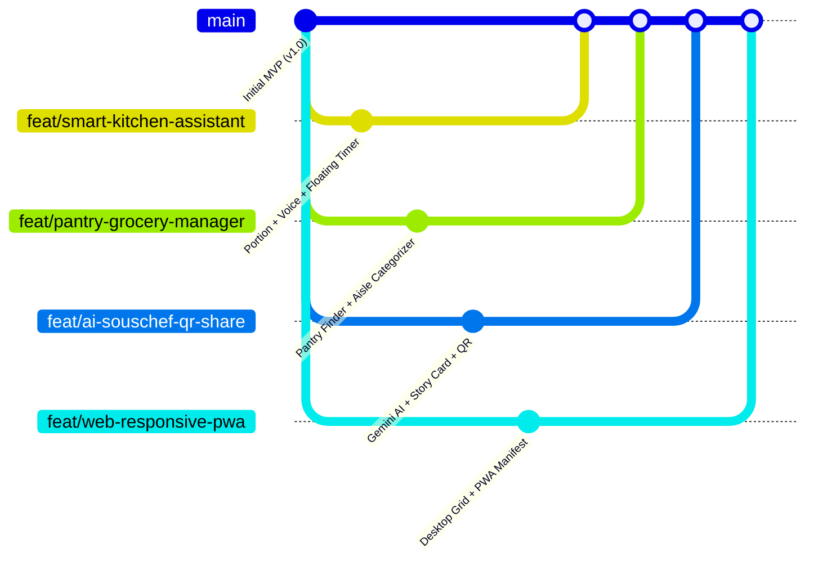

# 📋 CookFlow - Bảng Phân Công Công Việc & Kế Hoạch Phát Triển (Team Task Assignment)
> **Dự án:** CookFlow - Trợ Lý Nấu Ăn Đa Nền Tảng Thông Minh  
> **Môn học:** MMA301 - Multiplatform Mobile App Development (FPT University)  
> **Quy chuẩn Git Flow:** Phân nhánh theo tính năng `feat/<feature-name>`, tạo Pull Request về nhánh `main`.

---

## 🗺️ 1. Sơ đồ phân nhánh Git (Git Flow Overview)



---

## 📊 2. Bảng phân công nhiệm vụ tổng quan

| Nhánh Git | Tính năng chính | Thư viện bổ sung | Độ khó | Tiêu chí hoàn thành (DoD) |
| :--- | :--- | :--- | :--- | :--- |
| **`feat/smart-kitchen-assistant`** | Khẩu phần ăn linh hoạt + Đọc giọng nói (TTS) + Floating Timer | `expo-speech` | Trung bình | Tăng giảm khẩu phần tự đổi gram; đọc to bước nấu; timer nổi khi thoát |
| **`feat/pantry-grocery-manager`** | Tủ lạnh nhà tôi (Pantry Finder) + Phân loại giỏ đi chợ theo quầy | *(Không có)* | Dễ - Vừa | Tick chọn nguyên liệu lọc ra món nấu được; giỏ hàng chia nhóm siêu thị |
| **`feat/ai-souschef-qr-share`** | Gemini AI Sous-Chef + Xuất ảnh Story Instagram + Quét QR Code | `react-native-qrcode-svg`<br/>`react-native-view-shot`<br/>`expo-camera` | Khá | AI gợi ý thay thế gia vị; xuất file ảnh thẻ công thức; quét QR nhận món |
| **`feat/web-responsive-pwa`** | Web Desktop Dashboard 3 cột + Cài đặt PWA Offline + Tối ưu hóa render | Web Manifest | Trung bình | Giao diện tự co giãn trên PC/iPad; cài được app từ web; giảm giật lag |

---

## 🛠️ 3. Chi tiết từng nhánh & Hướng dẫn kỹ thuật

---

### 🌿 NHÁNH 1: Trải nghiệm Nấu ăn Thông minh & Hỗ trợ Giọng nói
* **Tên nhánh Git:** `feat/smart-kitchen-assistant`
* **Lệnh tạo và chuyển nhánh:**
  ```bash
  git checkout -b feat/smart-kitchen-assistant
  ```
* **Cài đặt thư viện:**
  ```bash
  npx expo install expo-speech
  ```

#### Mô tả chi tiết tính năng & luồng hoạt động:
1. **Dynamic Portion Scaler (Điều chỉnh khẩu phần ăn):**
   * **Vị trí:** `src/components/RecipeDetailModal.tsx`.
   * **Giao diện:** Thêm cụm nút bấm `[-] {servings} người [+]` tại thanh thống kê (stats row).
   * **Logic tính toán:**
     * Hệ số nhân: `ratio = currentServings / originalServings`.
     * Mỗi nguyên liệu `item.amount`: nếu là số (hoặc phân số) thì tự động nhân theo `ratio` và làm tròn 1 chữ số thập phân hoặc phân số dễ đọc (ví dụ: `300g` $\to$ `600g`, `0.5 muỗng` $\to$ `1 muỗng`).
2. **Hands-free Voice Guidance (Hỗ trợ giọng nói rảnh tay):**
   * **Vị trí:** `src/components/CookingModeModal.tsx`.
   * **Tính năng:**
     * Thêm nút `[🔊 Bật đọc tự động]` trên Header của Cooking Mode.
     * Khi người dùng chuyển sang bước mới: Tự động gọi `Speech.speak("Bước " + currentStep.stepNumber + ": " + currentStep.title + ". " + currentStep.instruction, { language: 'vi-VN' })`.
     * Hỗ trợ nút `[Dừng đọc]` và `[Nghe lại]`.
     * *(Nâng cao)*: Nhận diện giọng nói Web Speech API bắt từ khóa `"tiếp tục"` / `"qua bước"` để tự động kích hoạt `handleNext()`.
3. **Floating Multi-Timer (Đồng hồ đếm giờ thu nhỏ đa nhiệm):**
   * **Tạo file mới:** `src/components/ui/FloatingTimerWidget.tsx`.
   * **Tính năng:**
     * Khi người dùng đang chạy Timer ở một bước nấu mà bấm nút Đóng hoặc chuyển ra trang danh sách, Timer không bị hủy mà thu nhỏ thành 1 viên thuốc (Floating Pill) nổi ở góc dưới màn hình.
     * Hiển thị: `⏱ 03:45 • Đang hầm sườn...`.
     * Bấm vào viên thuốc sẽ mở lại đúng món ăn và bước nấu đang đếm giờ.

---

### 🌿 NHÁNH 2: Quản lý Nguyên liệu Tủ lạnh & Đi chợ theo Quầy
* **Tên nhánh Git:** `feat/pantry-grocery-manager`
* **Lệnh tạo và chuyển nhánh:**
  ```bash
  git checkout -b feat/pantry-grocery-manager
  ```
* **Cài đặt thư viện:** *(Sử dụng components React Native có sẵn)*

#### Mô tả chi tiết tính năng & luồng hoạt động:
1. **"Tủ lạnh nhà tôi" (What's in my Fridge / Smart Pantry Finder):**
   * **Tạo file mới:** `src/components/PantryFinderModal.tsx`.
   * **Giao diện:**
     * Lưới các nguyên liệu phổ biến dạng icon + chip bấm chọn (Trứng 🥚, Thịt bò 🥩, Thịt heo 🥓, Cà chua 🍅, Hành lá 🧅, Nấm 🍄, Nước tương 🍶...).
     * Ô nhập để thêm nguyên liệu tùy ý vào tủ lạnh.
   * **Thuật toán gợi ý món ăn:**
     * So sánh danh sách nguyên liệu đã chọn với mảng `recipe.ingredients` trong `recipes`.
     * **Món có thể nấu ngay:** Độ trùng khớp nguyên liệu chính = 100%.
     * **Món thiếu ít nguyên liệu:** Độ trùng khớp $\ge 70\%$ (hiển thị nhãn: `Chỉ thiếu 1 nguyên liệu: Nước dừa`).
2. **Smart Grocery Categorization (Phân loại giỏ đi chợ theo quầy siêu thị):**
   * **Vị trí:** `src/components/ShoppingListModal.tsx`.
   * **Cải tiến:**
     * Thay danh sách phẳng bằng `SectionList` chia theo 4 quầy hàng tiện lợi:
       1. 🥬 **Quầy Rau Củ & Trái Cây**
       2. 🥩 **Quầy Thịt & Thủy Hải Sản**
       3. 🧂 **Quầy Gia Vị & Đồ Khô**
       4. 🥛 **Quầy Trứng & Sữa**
     * Thêm nút `[📤 Gửi danh sách cho người thân]`: Định dạng chuỗi văn bản danh sách các món chưa mua kèm số lượng gửi nhanh qua Zalo, Messenger, tin nhắn SMS.

---

### 🌿 NHÁNH 3: Trí tuệ Nhân tạo AI Sous-Chef & Thẻ Chia Sẻ QR Code
* **Tên nhánh Git:** `feat/ai-souschef-qr-share`
* **Lệnh tạo và chuyển nhánh:**
  ```bash
  git checkout -b feat/ai-souschef-qr-share
  ```
* **Cài đặt thư viện:**
  ```bash
  npx expo install react-native-qrcode-svg react-native-view-shot expo-camera
  ```

#### Mô tả chi tiết tính năng & luồng hoạt động:
1. **Trợ lý AI Đầu Bếp (AI Sous-Chef - Google Gemini API):**
   * **Tạo file mới:** `src/components/AiChefChatModal.tsx` và `src/services/gemini.ts`.
   * **Tính năng:**
     * Nút bấm biểu tượng AI 🤖 tại màn hình Chi tiết món ăn và Cooking Mode.
     * Mở hộp thoại chat thông minh với các gợi ý sẵn:
       * 💡 *"Hết bơ lạt thì thay bằng gia vị gì và tỉ lệ bao nhiêu?"*
       * 🥗 *"Cách biến tấu món này cho người ăn kiêng / giảm calo?"*
       * 🍷 *"Gợi ý thức uống phù hợp dùng kèm món này?"*
     * Gọi trực tiếp Google Gemini 1.5 Flash REST API (Miễn phí qua Google AI Studio API Key).
2. **Export Recipe Card & QR Code Peer-to-Peer:**
   * **Xuất ảnh Story Card:**
     * Thiết kế template card dọc 9:16 thẩm mỹ với ảnh món ăn, độ khó, thời gian, tên công thức và watermark `CookFlow // Smart Assistant`.
     * Sử dụng `captureRef` từ `react-native-view-shot` để chụp và xuất thành file ảnh PNG.
     * Gọi `expo-sharing` (`Sharing.shareAsync`) mở hộp thoại lưu ảnh hoặc đăng lên mạng xã hội.
   * **Mã QR Chia sẻ Công thức không cần Server:**
     * **Bên chia sẻ:** Nhấn `[Tạo mã QR]` $\to$ serialize món ăn thành chuỗi JSON $\to$ hiển thị `<QRCode value={json} size={220} />`.
     * **Bên nhận:** Mở camera quét mã (`expo-camera`) $\to$ parse chuỗi JSON $\to$ gọi hàm `addRecipe()` lưu thẳng vào `RecipeContext` và `AsyncStorage` của máy bạn bè!

---

### 🌿 NHÁNH 4: Tối ưu Web Desktop Responsive & PWA
* **Tên nhánh Git:** `feat/web-responsive-pwa`
* **Lệnh tạo và chuyển nhánh:**
  ```bash
  git checkout -b feat/web-responsive-pwa
  ```
* **Thư viện / Cấu hình:** Web Manifest & Media Query Hooks

#### Mô tả chi tiết tính năng & luồng hoạt động:
1. **Desktop / Tablet Responsive Dashboard Layout:**
   * **Vị trí:** `src/app/index.tsx`.
   * **Cơ chế:** Sử dụng hook `useWindowDimensions()`:
     * **Màn hình Mobile (`width < 768px`):** Giữ nguyên layout 1 cột thanh thoát hiện tại.
     * **Màn hình Desktop/Tablet (`width >= 768px`):** Chuyển sang layout Dashboard 3 cột:
       * **Cột trái (280px):** Logo, Thanh tìm kiếm, Danh mục lọc cố định (Sidebar).
       * **Cột giữa (flex: 1):** Grid 2 - 3 cột danh sách món ăn với card hình chữ nhật rộng rãi.
       * **Cột phải (320px):** Panel xem trước món nổi bật và Giỏ đi chợ hiện tại.
2. **Cơ chế Progressive Web App (PWA):**
   * Tạo file `public/manifest.json` và cấu hình trong `app.json`:
     * Đặt tên ứng dụng: `CookFlow - Smart Cooking Assistant`.
     * Màu chủ đạo: `#FA3600`, nền `#F6F6F4`.
     * Cho phép người dùng bấm **"Install App" (Cài đặt ứng dụng)** trực tiếp trên Chrome/Safari/Edge.
3. **Refactor & Tối ưu hóa Codebase:**
   * Tách bớt các Modal lớn trong `index.tsx` thành các module độc lập.
   * Cập nhật logic `TimerCircle.tsx` theo `Date.now()` để tránh lỗi lệch giờ khi chuyển tab trình duyệt.
   * Chuyển component `Image` sang `expo-image` để kích hoạt bộ nhớ đệm (disk cache) và nén ảnh mượt mà.

---

## 🚀 4. Quy trình làm việc & Hợp nhất mã nguồn (Git Workflow Guide)

Mỗi thành viên khi nhận việc thực hiện theo đúng các bước sau để tránh xung đột mã nguồn (merge conflict):

### Bước 1: Kéo code mới nhất từ nhánh `main` về
```bash
git checkout main
git pull origin main
```

### Bước 2: Tạo nhánh riêng theo đúng tên quy định
```bash
# Ví dụ thành viên làm nhánh 1:
git checkout -b feat/smart-kitchen-assistant
```

### Bước 3: Code và Commit thường xuyên với mô tả rõ ràng
```bash
git add .
git commit -m "feat: implement dynamic portion scaling in recipe detail"
```

### Bước 4: Đẩy nhánh lên GitHub và tạo Pull Request (PR)
```bash
git push -u origin feat/smart-kitchen-assistant
```
* Sau khi push xong, vào trang GitHub của nhóm: [https://github.com/ptuoof/CookFlow-MMA301](https://github.com/ptuoof/CookFlow-MMA301).
* Nhấn nút xanh **`Compare & pull request`**.
* Gán Leader / Thành viên khác review code trước khi gộp (Merge) vào nhánh `main`.

---
*Tài liệu được tạo tự động cho nhóm phát triển đồ án môn MMA301 - CookFlow Team.*
